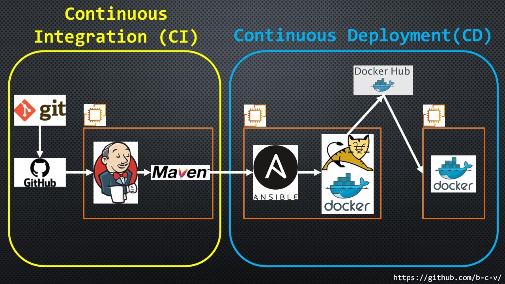

# v1.0 CI/CD pipeline

Description:
CI/CD project Git==>GitHub==>Jenkins==>Maven==>Ansible==>Tomcat&Docker==>DockerHub==>Web Server
When making changes to the GitHub repository with the simple Java application - Jenkins starts the process of building and testing it with Maven and transfers to Ansible server. Ansible starts the process of building the Docker image and copying it to DockerHub. After that, this image is uploaded from DockerHub to the Docker server and running.



---

## 1. Docker server

### 1.1 launch AmazonLinux EC2 Instance and create a new Security group (allowing SSH and HTTP).

### 1.2 connect via SSH to instance, download to it and run a script [2.1_install_docker.sh](2_Docker/2.1_install_docker.sh) and it will install Docker and change hostname.

### 1.3 create a user under which Jenkins will connect to the server. Download to it and run a script [2.2_create_user_docker.sh](2_Docker/2.2_create_user_docker.sh)

### 1.4 create a user under which Ansible will connect to the server. Download to it and run a script [2.3_create_user_ansible.sh](2_Docker/2.3_create_user_ansible.sh)

---

## 2. Ansible server

### 2.1 launch a second AmazonLinux EC2 Instance and connect to the same security group as the previous one.

### 2.2 connect via SSH to instance, download to it and run a script [3.1_install_ansible_amazon.sh](3_Ansible/3.1_install_ansible_amazon.sh) and it will install Ansible, Docker and change hostname.

### 2.3 create a user under which Ansible will connect to the Docker-server and the working directory of the project _(/opt/docker/)_. Run script [3.2_create_user_ansible.sh](3_Ansible/3.2_create_user_ansible.sh)

### 2.4 change SSH-keys with servers:

- generate SSH-key for created user:

```bash
su *your_user_name*
ssh-keygen
```

- exchange ssh-key

```bash
ssh-copy-id *ip_localhost* #it's necessary to exchange the SSH-key with the local server on behalf of the created user
ssh-copy-id *ip_docker_server*
```

### 2.5 Login to DockerHub:

```bash
docker login
```

### 2.6 Copy files to directory _(/opt/docker/)_:

- [Dockerfile](3_Ansible/Dockerfile)
- [3.3_playbook_push_image.yml](3_Ansible/3.3_playbook_push_image.yml)
- [3.4_playbook_run_container.yml](3_Ansible/3.4_playbook_run_container.yml)

---

## 3. Jenkins server

### 3.1 Launch a third AmazonLinux EC2 Instance and connect to the same security group as the previous two.

### 3.2 connect via SSH to instance, download to it and run a script [1.1_install_packages_AmazonLinux.sh](1_Jenkins\1.1_install_packages_AmazonLinux.sh)

It will install:

- Jenkins and Java
- GIT
- Maven
- rename hostname to "jenkins"

### 3.3 In Jenkins settings create token (Manage Jenkins==>Manage Users==>_your_user_name_==>Configure==>API Token==>Add new token) and run script [1.2_install_jenkins_plugins.sh](1_Jenkins/1.2_install_jenkins_plugins.sh)

It will install plugins:

- GIT
- Maven
- Deploy (pack Java war file to docker container)
- GitHub (trigger to run build project after push changes to git repo)
- Publish over SSH (for connection to Docker-server and Ansible-server)

### 3.4 Create trigger to automatically start a job in Jenkins, when some changes are made to the GitHub repository

- in settings GitHub repository with the project, specify the address of Jenkins-server and type of events to trigger this webhook _(http://ip_jenkins_server:8080/github-webhook/)_
  

### 3.5 Manually configure Jenkins

- Manage Jenkins ==> Configure System ==> Publish over SSH add IP address of Ansible-server, username and created user password.

  

  > A better solution is to use an SSH key

- Manage Jenkins ==> Global Tool Configuration ==> configure GIT, JDK and Maven
  
  
  

### 3.6 Create new Item (Maven project)


> script to section "Exec command" is in file [3.5_script_to_project.txt](3_Ansible\3.5_script_to_project.txt)

- or from file [CICD_Ansible.xml](1_Jenkins/CICD_Ansible.xml) export settings of this project:

```bash
java -jar jenkins-cli.jar -s http://localhost:8080/ -auth *your_user:your_token* -webSocket create-job Ansible_CI_CD < CICD_Ansible.xml)
```

## If you type in a link http://ip_docker_server/webapp in a browser, you can see

## 
