# CI/CD pipeline

## Continuous integration (CI)

1. Install Jenkins:

- On local machine (Ubuntu) and run script 1_Jenkins/1.1_install_packages.sh
- If you want to use webhook from GitHub to Jenkins for CI process - it's necessary use AmazonLinux EC2 Instance with public IP. Run script 1_Jenkins/1.1.1_install_packages_AmazonLinux on EC2.

  They will:

  - install Jenkins
  - install GIT
  - install Maven
  - install Terraform
  - install AWS (only on Ubuntu)
  - clone all configuration files from this repo to folder Download

2. Install Jenkins plugins:

- in Jenkins settings create token (Manage Jenkins==>Manage Users==>user_name==>Configure==>API Token==>Add new token) and run script 1_Jenkins/1.2_install_jenkins_plugins.sh
  It will install plugins:

  - GIT
  - Maven
  - Deploy (pack Java war file to docker container)
  - GitHub (trigger to run build project after push changes to git repo)
  - Publish over SSH (for connection to Docker server)

3. Create AmazonLinux EC2 instance with Tomcat:

- "terraform init" and "terraform apply" project in folder 2_Tomcat_terraform. During instance initialization will:

  - change hostname
  - install Java
  - install Tomcat

- Or on AmazonLinux run script 2_Tomcat_terraform/modules/webserver/installTomcat.sh

4. Manually configure Tomcat:

- comment in files /opt/tomcat/webapps/host-manager/META-INF/context.xml and /opt/tomcat/webapps/manager/META-INF/context.xml line <Valve className="org.apache.catalina.valves.RemoteAddrValve" allow="127\.\d+\.\d+\.\d+|::1|0:0:0:0:0:0:0:1" />
- add users to file /opt/tomcat/conf/tomcat-users.xml
  <role rolename="manager-gui"/>
  <role rolename="manager-script"/>
  <role rolename="manager-jmx"/>
  <role rolename="manager-status"/>
  <user username="admin" password="your_password" roles="manager-gui, manager-script, manager-jmx, manager-status"/>
  <user username="deployer" password="your_password" roles="manager-script"/>
  <user username="tomcat" password="your_password" roles="manager-gui"/>

5. Manually configure Jenkins:

- Manage Jenkins ==> Global Tool Configuration configure GIT, JDK and Maven
  
  
  
- Add credentials to connect with Tomcat server
  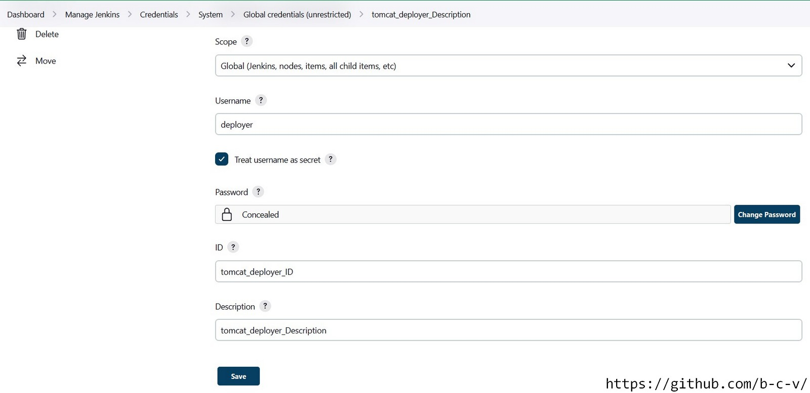
- Create new Item (Maven project)
  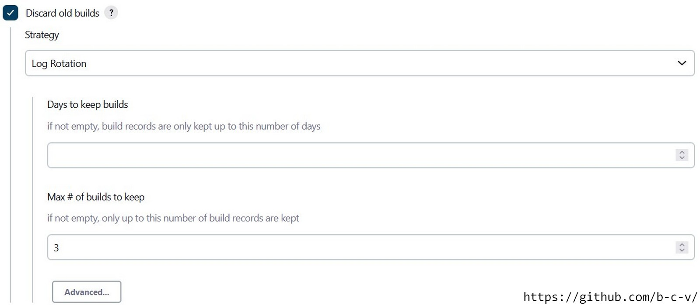
  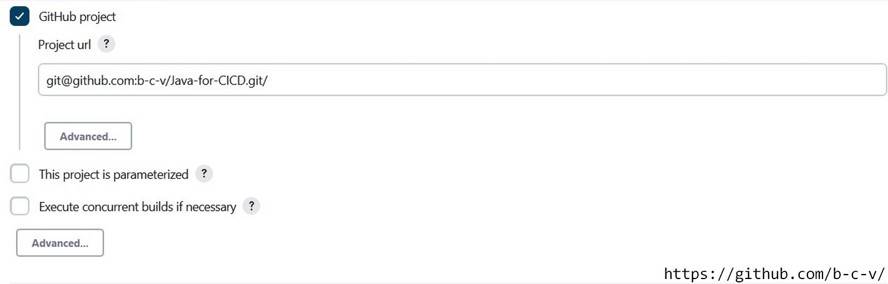
  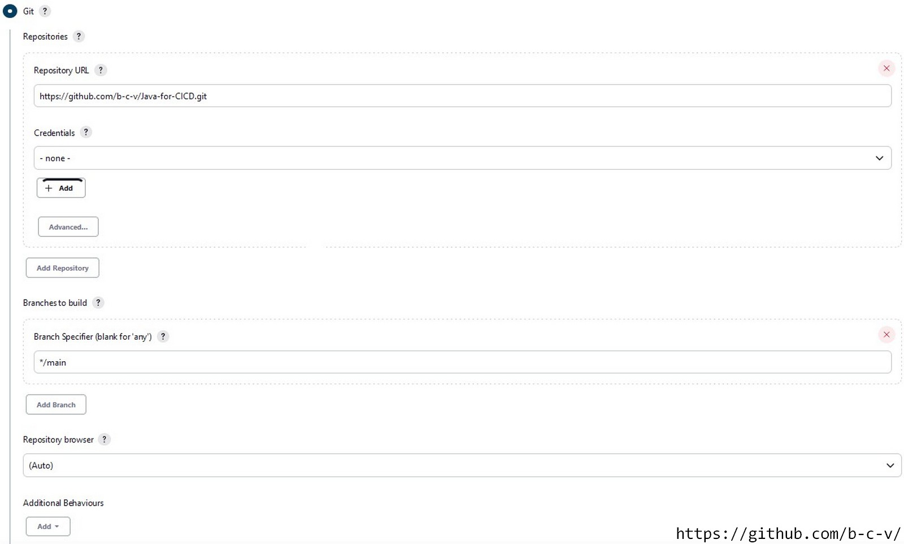
  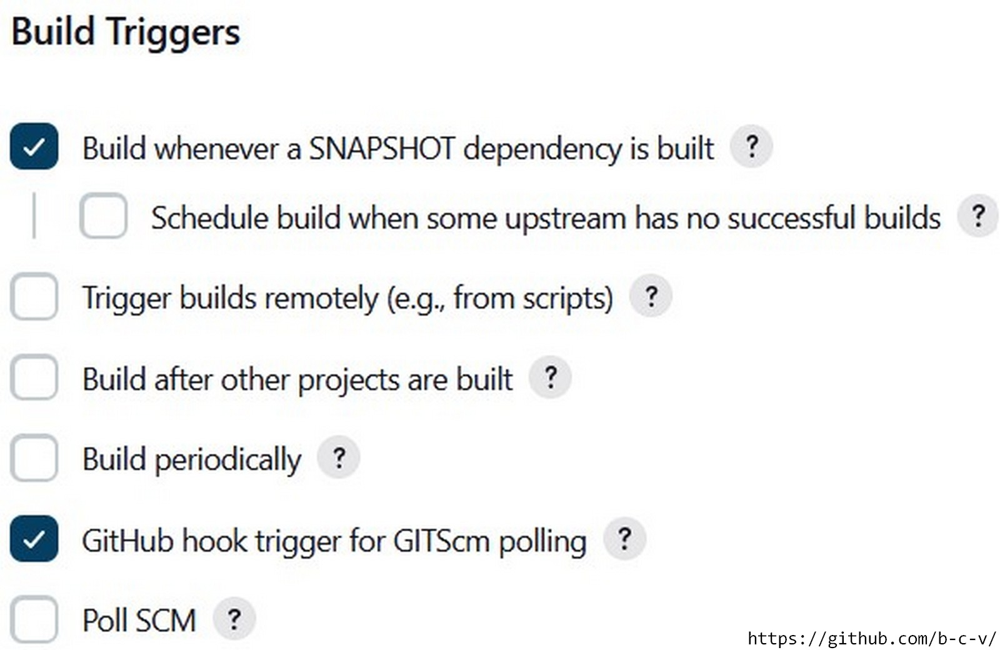
  
  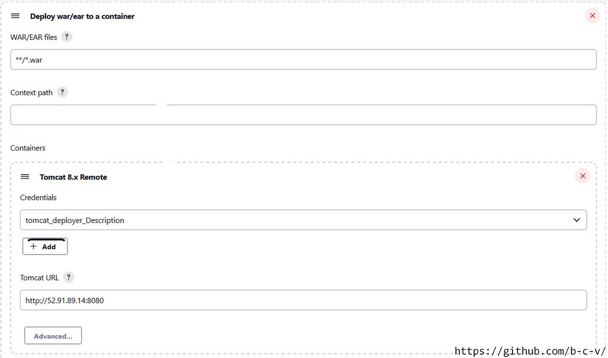
- or from file 1_Jenkins/CICD_Tomcat.xml export settings of this project (command: java -jar jenkins-cli.jar -s http://localhost:8080/ -auth user:token -webSocket create-job Tomcat_CI_CD < CICD_Tomcat.xml)

### CI project is ready (Git==>GitHub==>Jenkins==>Maven)

---

## Continuous delivery/deployment (CD) Docker

1. Install Docker:

- create EC2 instance in some security group with Jenkins
- run script 3_Docker/install_docker.sh
- create a user under which Jenkins will connect to the server. Run script 3_Docker/3.3_create_user_docker.sh

2. Manually configure Jenkins:

- Manage Jenkins ==> Configure System ==> Publish over SSH add IP address of Docker-server, username and password created user.
  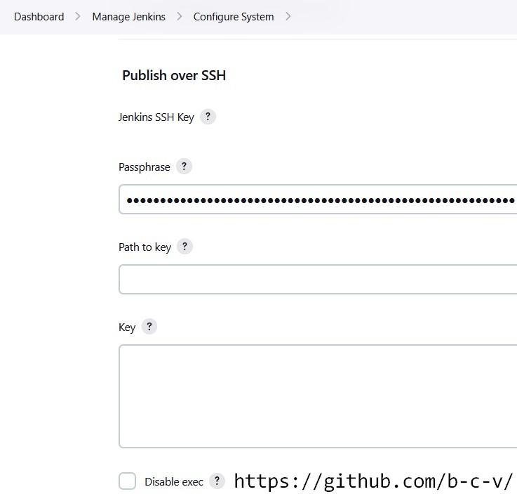
  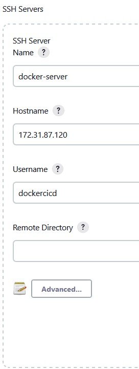

  \*Better solution is to use an SSH key, but next I want to use Ansible + DockerHub + Kubernetes, and therefore ,in this case, it is not very important

3. Create new Item (Maven project):
   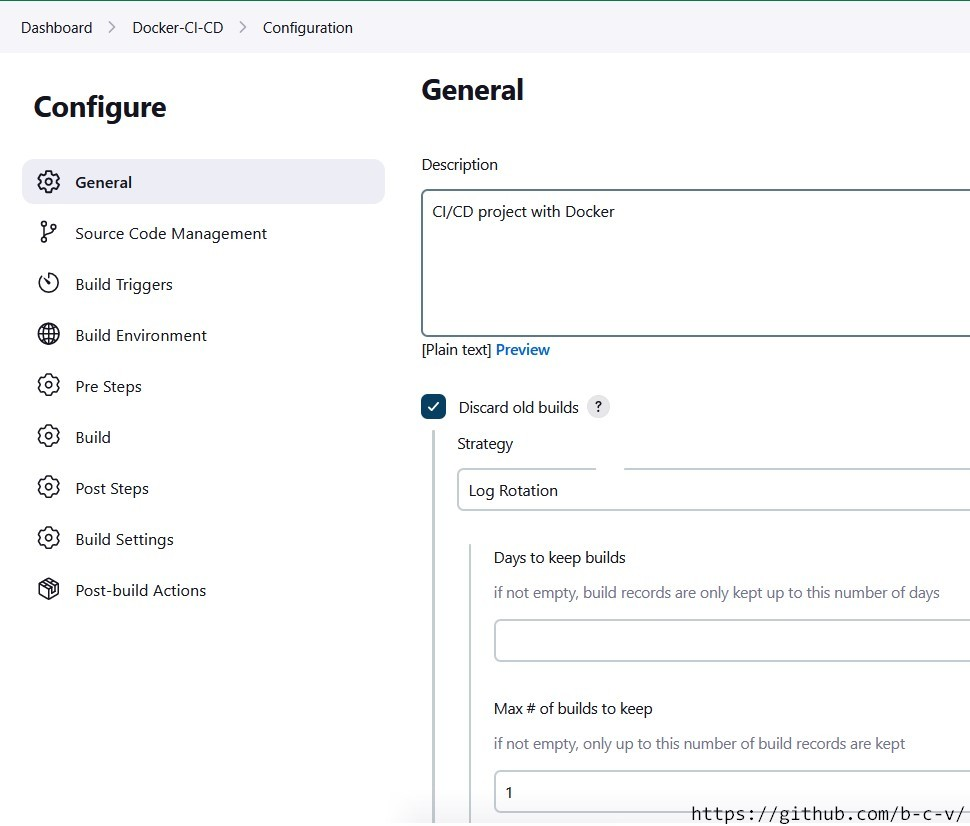
   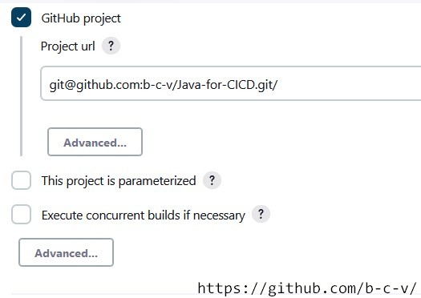
   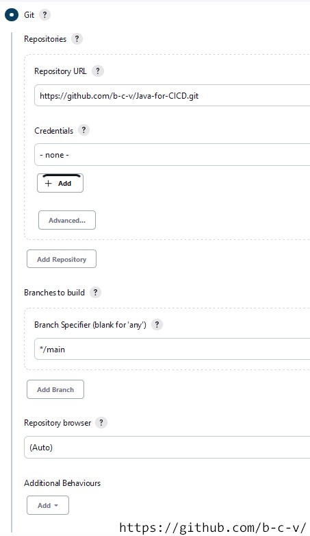
   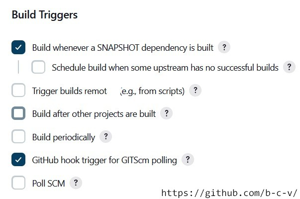
   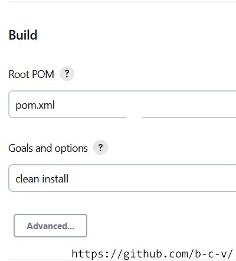
   

   - script to section "Exec command" is in file 3_Docker/3.4_script_to_project.txt

- or from file 1_Jenkins/CICD_Docker.xml export settings of this project (command: java -jar jenkins-cli.jar -s http://localhost:8080/ -auth user:token -webSocket create-job Docker_CI_CD < CICD_Docker.xml)

### CI/CD project is ready (Git==>GitHub==>Jenkins==>Maven==>Tomcat&Docker)

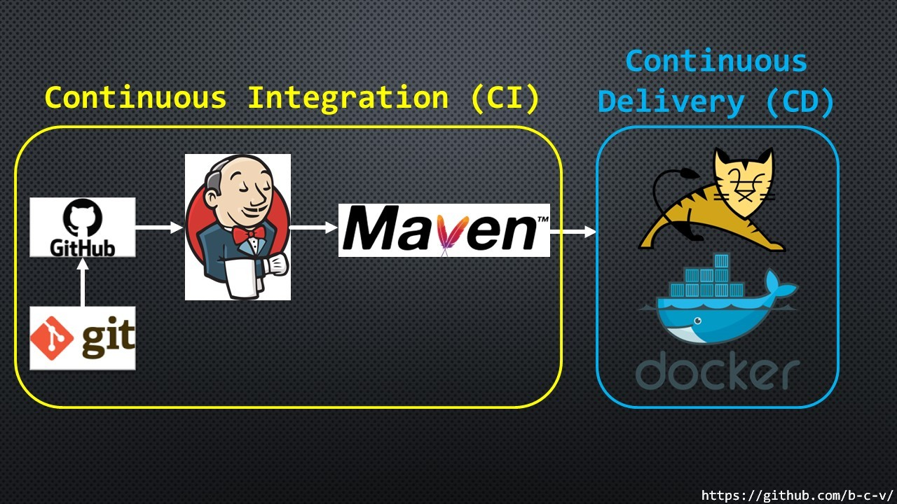

## Continuous delivery/deployment (CD) Ansible
