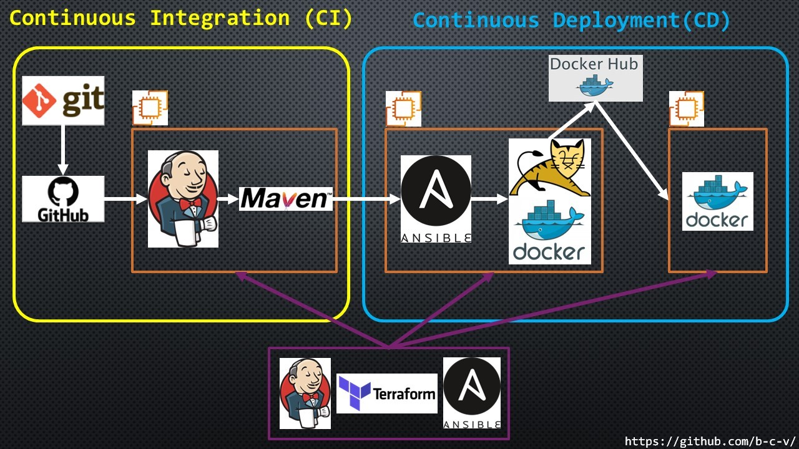

# v1.2 CI/CD pipeline

**_Description:_**

CI/CD project Terraform ==> Git==>GitHub==>Jenkins==>Maven==>Ansible==>Tomcat&Docker==>DockerHub==>Web Server

When making changes to the GitHub repository with the simple Java application - Jenkins starts the process of building and testing it with Maven and transfers to Ansible server. Ansible starts the process of building the Docker image and copying it to DockerHub. After that, this image is uploaded from DockerHub to the Docker server and running.



---

## 1. Preparing the environment for project implementation:

### 1.1 On your local computer (Ubuntu), download directory [1_environment](1_environment)

### 1.2 Run the script [1_install_packages_Ubuntu.sh](1_environment/1_install_packages_Ubuntu.sh). At the end of the installation process enter credentials to connect to AWS

```
chmod +x 1_install_packages_Ubuntu.sh
source 1_install_packages_Ubuntu.sh
```

### 1.3 In derectory \1_environment\Terraform\ create a file "terraform.tfvars" and enter the values of variables. For example:

```bash
main_vpc_cidr_block    = "10.0.0.0/16"
main_subnet_cidr_block = "10.0.10.0/24"
main_avail_zone        = "eu-central-1a"
main_env_prefix        = "CICD"
main_my_ip             = "0.0.0.0/0"
main_instance_type     = "t2.micro"
main_my_publick_key_location = "~/.ssh/id_rsa.pub"
main_image_name = "amzn2-ami-kernel-*-x86_64-gp2"
```

### 1.4 Create ssh key with name aws in folder ~/.ssh/

```
ssh-keygen -f /tmp/aws
sudo chown jenkins:jenkins /tmp/aws*
```

### 1.5 in Jenkins

1.5.1 Jenkins ==> Manage Jenkins ==> Global Tool Configuration add information where installed:

- Terraform. Find where it installed:

```
whereis terraform
```

- Ansible. Find where it installed

```
which ansible
```


1.5.2 Jenkins ==> Manage Jenkins ==> Manage Credentials ==> (global) ==> Add credentials ==> AWS Credentials Add credentials to connect to AWS (ID: cicd-credentials)

1.5.3 Create Jenkins pipeline job, paste code from [Jenkinsfile](1_environment/Jenkinsfile) and run. The process of launching three servers using the Terraform and their configuration using the Ansible will begin.

## 2. Ansible server

<!-- ### 2.1 change SSH-keys with servers:

- generate SSH-key for created user:

```bash
su *your_user_name*
ssh-keygen
``` -->

### 2.1 Exchange ssh-key

```bash
su *your_user_name*
ssh-copy-id *private_ip_localhost* #it's necessary to exchange the SSH-key with the local server on behalf of the created user
ssh-copy-id *private_ip_docker_server*
```

### 2.2 Login to DockerHub:

```bash
docker login
```

### 2.3 Copy files to directory _(/opt/docker/)_:

- [Dockerfile](3_Ansible/Dockerfile)
- [3.3_playbook_push_image.yml](3_Ansible/3.3_playbook_push_image.yml)
- [3.4_playbook_run_container.yml](3_Ansible/3.4_playbook_run_container.yml)

---

## 4. Jenkins server

### 4.1 Create trigger to automatically start a job in Jenkins, when some changes are made to the GitHub repository

- in settings GitHub repository with the project, specify the address of Jenkins-server and type of events to trigger this webhook _(http://ip_jenkins_server:8080/github-webhook/)_
  

### 4.2 Manually configure Jenkins

- Manage Jenkins ==> Configure System ==> Publish over SSH add IP address of Ansible-server, username and created user password.

  

  > A better solution is to use an SSH key

- Manage Jenkins ==> Global Tool Configuration ==> configure GIT, JDK and Maven
  
  
  

### 4.3 Create new Item (Maven project)


> script to section "Exec command" is in file [3.5_script_to_project.txt](3_Ansible\3.5_script_to_project.txt)

- or from file [CICD_Ansible.xml](1_Jenkins/CICD_Ansible.xml) export settings of this project:

```bash
java -jar jenkins-cli.jar -s http://localhost:8080/ -auth *your_user:your_token* -webSocket create-job Ansible_CI_CD < CICD_Ansible.xml)
```

---

## If you type in a link `http://ip_docker_server/webapp` in a browser, you can see


